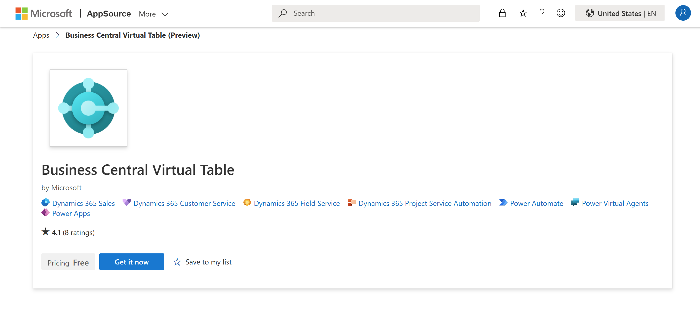

# Business Events on Business Central (Preview)

## Introducing business events
Integrating w/ Dataverse enables Business Central to interact w/ other apps in its ecosystem, see [a review of Business Central & Dataverse integration](https://github.com/microsoft/d365bcdv/blob/main/Review%20of%20Business%20Central%20and%20Dataverse%20integration.pdf).  There are four types of complementary app/system interactions: Data Sync that replicates data between Business Central & Dataverse, virtual tables on Dataverse via Business Central API for (**C**reate/**R**ead/**U**pdate/**D**elete) operations, data change (**CUD**) events, and business events.


We've introduced the new feature of business events to preview in *Dynamics 365 Business Central 2023 Wave 1 Release* (**22.x**).  It provides our partners/customers a mechanism for notifying/triggering their external Dataverse/non-Dataverse systems when actions are performed on Business Central, so their external systems can react/perform other actions in response.  On Dataverse, they can use Power Automate to subscribe to Business Central for its business events and react on other apps in its ecosystem, such as Dynamics 365 Sales/Customer Service and others built using Power Apps.  They can also react on non-Dataverse systems, such as 3rd party warehouse management/fulfillment/e-invoicing services.


This article highlights the new feature of business events, the prerequisites and step-by-step instructions to preview it, as well as its current limitations/future improvements.

## Prerequisites and step-by-step instructions
To preview the new feature of business events on Business Central, you can/should:
1. Create/upgrade a Business Central environment with *Dynamics 365 Business Central 2023 Wave 1 Release* (**22.x**).  On **22.0/22.1**, you'll need to build an extension that implements our *Dynamics 365 Business Central* catalog of sample business events, while on **22.2 or higher**, our business events are already added/built in.
1. If you're on **22.0/22.1**, collect the source files published here to build and install the above mentioned extension.
1. On Business Central app, use the assisted setup to connect your Business Central environment to a Dataverse environment, on which you want to submit subscriptions and receive notifications of business events.  This will guide you to install the *Business Central Virtual Table (Preview)* plugin from AppSource that enables business event subscriptions/notifications on your Dataverse environment.  Make sure that you install the latest version that supports business events (**1.023093.3 or higher**).
1. Assign the *Ext. Events – Subscr* permissions set to Business Central users who want to subscribe to specific companies for their business events.
1. On Power Apps maker portal, find and edit the **Business Central Virtual Data Source Configuration** table to refresh Business Central catalog with sample business events on your Dataverse environment.
1. On Power Apps maker portal, create Power Automate flows with the **When an action is performed** trigger that query Business Central catalog, submit subscriptions, and receive notifications of business events on your Dataverse environment.
1. (OPTIONAL) Following our code, build and install your own extension that adds custom business events to Business Central catalog.  Use the same **Business Central Virtual Data Source Configuration** table to refresh Business Central catalog with custom business events on your Dataverse environment.  This should also be done if you make changes to your custom business events.
1. (OPTIONAL) Query Business Central catalog, submit subscriptions, and receive notifications of business events on your non-Dataverse environment.
1. (OPTIONAL) Fill out [our survey](https://forms.office.com/r/GkvB6pritG) to let us know which business events you'll try/build in preview, which additional business events we should add for general availability, in which scenarios do you want to use these business events, and your email contact for us to follow up. 

## Build and install an extension for sample business events

If your Business Central environment is on **22.0/22.1**, you can easily build and install an extension that implements the following sample business events for preview:

| **Category** | **Name** | **Description** |
|--------------|----------|-----------------|
| My Accounts Payable Events | Purchase invoice posted | This business event is triggered when a vendor invoice is posted as part of the Procure-to-Pay process. |
| My Accounts Payable Events | Purchase payment posted | This business event is triggered when a vendor payment is posted as part of the Procure-to-Pay process. |
| My Accounts Payable Events | Purchase receipt posted | This business event is triggered when goods from a purchase order are received by the internal warehouse/external logistics company. This can trigger Finance Department to post a purchase invoice. |
| My Accounts Receivable Events | Customer blocked | This business event is triggered when a customer is blocked for shipping/invoicing. |
| My Accounts Receivable Events | Customer unblocked | This business event is triggered when a customer is unblocked for shipping/invoicing. |
| My Accounts Receivable Events | Sales credit limit exceeded | This business event is triggered when the credit limit for a customer is exceeded due to a posted sales invoice/changed credit limit for that customer. |
| My Accounts Receivable Events | Sales credit memo posted | This business event is triggered when a sales credit memo is posted. |
| My Accounts Receivable Events | Sales invoice posted | This business event is triggered when a sales invoice is posted as part of the Quote-to-Cash process. |
| My Accounts Receivable Events | Sales payment posted | This business event is triggered when a customer payment is posted as part of the Quote-to-Cash process. |
| My Accounts Receivable Events | Sales shipment posted | This business event is triggered when goods from a sales order are shipped by the internal warehouse/external logistics company. This can trigger Finance Department to post a sales invoice. |
| My Purchasing Events | Purchase order released | This business event is triggered when a purchase order is released to the internal warehouse/external logistics company, so they're ready to receive goods coming their way. This trigger occurs when the Release button is clicked on Purchase Order page in Business Central. |
| My Sales Events | Sales order released | This business event is triggered when a sales order is released to the internal warehouse/external logistics company, so they're ready to pick and ship goods. This trigger occurs when the Release button is clicked on Sales Order page in Business Central. |

To build and install an extension that implements those sample business events for preview, follow these steps:
1. Collect two AL files (*MyEventCategory.EnumExt.al* and *MyBusinessEvents.al*) from this preview folder.
1. Build an extension by adding those files to your AL project in Visual Studio Code, see [Developing in AL](https://learn.microsoft.com/dynamics365/business-central/dev-itpro/developer/devenv-dev-overview).

   
   
1. Install the extension on your Business Central environment, see [Installing Extensions in Business Central](https://learn.microsoft.com/dynamics365/business-central/ui-extensions-install-uninstall).

If your Business Central environment is on **22.2 or higher**, our Business Central catalog already has more business events added/built-in.

## Connect Business Central to Dataverse 
To connect your Business Central environment to a Dataverse environment, on which you want to submit subscriptions and receive notifications of business events, follow these steps:
1.	On Business Central app, select the **Settings** icon, select the **Assisted setup** item, and then select the **Set up a connection to Dataverse** item to open the **Dataverse Connection Setup** dialog.  
1.	On that dialog, flip the **Enable virtual tables and events** switch on and select the **Next** button.

   

1.	Review the relevant terms and conditions, flip the **I accept** switch on, and select the **Next** button again.
1.	Specify your Dataverse environment URL, sign in as an administrator user, and select the **Next** button again.
1.	Install the *Business Central Virtual Table (Preview)* plugin from AppSource that enables business event subscriptions/notifications on your Dataverse environment, make sure that you install the latest version that supports business events (**1.023093.3 or higher**), and finally select the **Finish** button.

   

## Refresh Business Central catalog of business events
To refresh our business event catalog after installing your extension, follow these steps:
1.	On Power Apps maker portal, select the **Tables** section, search for the **Business Central Virtual Data Source Configuration** table under the **All** tab, and select it.
1.	Select the **Edit** button, select the **Business Central** row, and select the **Edit row using form** button to open a form.
1.	Select the **Refresh Business Event Catalog** button on that form.

   

## Query Business Central catalog, submit subscriptions, and receive notifications of business events on Dataverse 
To query Business Central catalog, submit subscriptions, and receive notifications of business events on your Dataverse environment, follow these steps:
1.	On Power Apps maker portal, select the **Flows** section and create Power Automate flows with the **When an action is performed** trigger.
1.	Select the *Dynamics 365 Business Central* catalog, select one of the categories, such as *My Accounts Receivable Events*, select *(none)* as table name, and select one of the business events to subscribe in that category, such as *Customer blocked*, as action name.
1.	Select the **+ New step** button to continue your flows to process the received notifications.

   

## Build and install an extension for custom business events
To build and install an extension that implements custom business events, follow these steps:
1.	Identify/create relevant AL files to code your custom business events.
1.	Identify existing categories for your custom business events or create new ones using the extensible enum.
1.	Create a procedure with empty body for each custom business event.
1.	Add the *ExternalBusinessEvent* attribute to define the business event name, display name, description, and category.
1.	Add the optional *RequiredPermissions* attribute to enforce additional permissions for users to subscribe.
1.	Add the required parameters to define the business event payload.
1.	Identify a specific AL event to subscribe and invoke the custom business event procedure w/ appropriate parameters when it occurs.
1.	Build an extension by adding those files to your AL project in Visual Studio Code, see [Developing in AL](https://learn.microsoft.com/dynamics365/business-central/dev-itpro/developer/devenv-dev-overview).
1.	Install the extension on your Business Central environment that we've enabled for private preview, see [Installing Extensions in Business Central](https://learn.microsoft.com/dynamics365/business-central/ui-extensions-install-uninstall).
1. Use the **Business Central Virtual Data Source Configuration** table to refresh Business Central catalog with custom business events on your Dataverse environment (see above).

```al
enumextension 50101 MyEnumExtension extends EventCategory
{
   value(0; "Sales")
   {
   }
}

codeunit 50102 MyCodeunit 
{ 
   trigger OnRun()
   begin
   end; 

   [ExternalBusinessEvent('salesorderposted', 'Sales order posted', 'Triggered when sales order has been posted', EventCategory::"Sales")]
   [RequiredPermissions(PermissionObjectType::TableData, Database::"Sales Header", 'R')] // optional
   procedure SalesOrderPosted(salesOrderId: Guid; customerName: Text; orderNumber: Text)
   begin
   end;
   
   [EventSubscriber(ObjectType::Page, Page::"Sales Order", 'OnPostDocumentBeforeNavigateAfterPosting', '', true, true)] 
   local procedure OnPostDocument(var SalesHeader: Record "Sales Header"; var PostingCodeunitID: Integer; var Navigate: Enum "Navigate After Posting"; DocumentIsPosted: Boolean; var IsHandled: Boolean) 
   begin
      SalesOrderPosted(SalesHeader.SystemId, SalesHeader."Sell-to Customer Name", SalesHeader."No."); 
   end;
} 
```

## Query Business Central catalog, submit subscriptions, and receive notifications of business events on non-Dataverse systems
Business Central exposes specific APIs for business events that can be used to:
- Query Business Central catalog for business event definitions
- Submit business event subscriptions w/ your own notification URL

The *Business Central Virtual Table (Preview)* plugin uses the same APIs to query Business Central catalog and submit subscriptions of business events for Power Automate flows.

### Query Business Central catalog of business events
To query Business Central catalog for business event definitions, you can send a request to the *externalbusinessdefinitions* endpoint:

```yaml
Request: GET api/microsoft/runtime/v1.0/externalbusinesseventdefinitions

Response: "value": [{
   "category": "Sales",
   "name": "salesorderposted",
   "displayName": "Sales order posted",
   "description": "Triggered when sales order has been posted",
   "payload": "[{\"Index\":0,\"Name\":\"salesOrderId\",\"Type\":\"Guid\"},{\"Index\":1,\"Name\":\"customerName\",\"Type\":\"Text\"},{\"Index\":2,\"Name\":\"orderNumber\",\"Type\":\"Text\"}]",
   "appId": "xxxxxxxx-xxxx-xxxx-xxxx-xxxxxxxxxxxx",
   "appName": "MyBCExtension",
   "appVersion": "1.0.0.0",
   "appPublisher": "Default publisher"
}]
```

For each business event, the response to your request will contain the following data:
- *category*: The enum value of category for this business event
- *name*: The name of this business event
- *displayName*: The display name of this business event
- *description*: The description of this business event
- *payload*: The serialized text in JSON format that defines the payload parameters for this business event – Each payload parameter is defined by an array of objects in JSON format, for example:
  ```yaml
  {
     "Index": 0,
     "Name": "salesOrderId",
     "Type": "Guid"
  }
  ```
  The objects that define each payload parameter are:
  - *Index*: The index counter for this payload parameter 
  - *Name*: The name of this payload parameter
  - *Type*: The type of this payload parameter – We use Business Central parameter types that allow only the following values: *Byte*, *Char*, *Guid*, *Text*, *Text[length]*, *String*, *Enum*, *Code*, *Boolean*, *Decimal*, *Integer*, *BigInteger*, *Date*, *Time*, *DateTime*, *Option*, *RecordId*, *ObjectType*
- *appId*: The GUID of Business Central extension that implements this business event
- *appName*: The name of Business Central extension that implements this business event
- *appVersion*: The version of Business Central extension that implements this business event
- *appPublisher*: The publisher of Business Central extension that implements this business event

Any authenticated Business Central user can query Business Central catalog for business event definitions.

### Submit subscriptions of business events
To submit business event subscriptions w/ your own notification URL, you can send requests to the *externaleventsubscriptions* endpoint:

```yaml
Request: POST api/microsoft/runtime/v1.0/externaleventsubscriptions
{
   "companyName": "CRONUS USA, Inc.",
   "eventName": "salesorderposted",
   "appId": "xxxxxxxx-xxxx-xxxx-xxxx-xxxxxxxxxxxx",
   "notificationUrl": "https://webhook.site/xxxxxxxx-xxxx-xxxx-xxxx-xxxxxxxxxxxx",
   "clientState": "" (optional)
}

Response: Empty w/ status code 201 Created
```

For each business event, your request must contain the following data:
- *companyName*: The name of company to subscribe for this business event
- *eventName*: The name of this business event
- *appId*: The GUID of Business Central extension that implements this business event
- *notificationUrl*: The URL to post notifications of this business event 
- *clientState*: The optional string associated with this business event subscription that can be used to validate any caller's posting to the notification URL

Only Business Central users who have been assigned the *Ext. Events – Subscr* permissions set can subscribe to specific companies for their business events.  Subscribers must have READ access to the *ExternalBusinessEventDefinition* table in subscribed companies.  Additionally, they must have relevant access in the subscribed companies as defined by the optional *RequiredPermissions* attribute.

### Receive notifications of business events
When a business event occurs and a subscription exists for it, Business Central will send a request to the relevant notification URL:

```yaml
Request: POST https://webhook.site/xxxxxxxx-xxxx-xxxx-xxxx-xxxxxxxxxxxx
{
   "initiatingUserAADObjectId": "xxxxxxxx-xxxx-xxxx-xxxx-xxxxxxxxxxxx",
   "timestamp": "2023-02-20T10:27:35.8770000Z",
   "companyName": "CRONUS USA, Inc.",
   "eventName": "salesorderposted",
   "payload": 
   {
     "salesOrderId": "xxxxxxxx-xxxx-xxxx-xxxx-xxxxxxxxxxxx",
     "customerName": "Adatum Corporation",
     "ordernumber": "S-ORD101005"
   },
   "appId": "xxxxxxxx-xxxx-xxxx-xxxx-xxxxxxxxxxxx",
   "clientState": ""
}
```

This request will contain the following data:
- *initiatingUserAADObjectId*: The Azure Active Directory object ID of user who initiated this business event
- *timestamp*: The timestamp when this business event occurred (UTC)
- *companyName*: The name of company where this business event occurred
- *eventName*: The name of this business event
- *payload*: The payload of this business event with parameter names and values that match their definitions
- *appId*: The GUID of Business Central extension that implements this business event
- *clientState*: The optional string associated with this business event subscription that can be used to validate any caller's posting to the notification URL

Subscribers must still have READ access to the *ExternalBusinessEventDefinition* table in subscribed companies.  Additionally, they must still have relevant access in the subscribed companies as defined by the optional *RequiredPermissions* attribute.

## Current limitations and future improvements
These are the current limitations for business events on Business Central that will be removed/improved in the near future:

1.	Business Central's *companyId* property isn't included when submitting subscriptions and receiving notifications of business events for now.
1.	When creating Power Automate flows with the **When an action is performed** trigger, you can't select specific companies to subscribe for their business events, so business event subscriptions are submitted for all companies accessible to you for now.
1. Translation and versioning for business events aren't supported for now.
1. Before you ask ; ), public preview is planned for one of Dynamics 365 Business Central minor releases (**22.1/22.2**).
