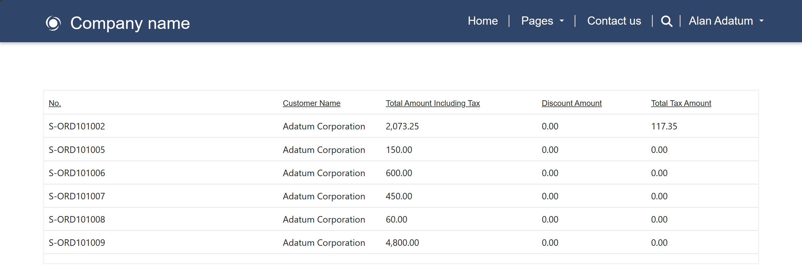

# Power Pages on Virtual Tables (Preview)

## Introduction
Data virtualization is part of the fabric/one of the tools to integrate Business Central online with Microsoft Dataverse/Power Platform, see [a review of Business Central & Dataverse integration](https://github.com/microsoft/d365bcdv/blob/main/Review%20of%20Business%20Central%20and%20Dataverse%20integration.pdf).  It allows users with Business Central licenses/entitlements to access data stored in Business Central online by performing (**C**reate/**R**ead/**U**pdate/**D**elete) API operations on Business Central tables that are available as virtual tables in Dataverse.  

These licensed users are considered as internal users to the organizations/companies that purchase those licenses.  They’re in employee-like relationships with the companies and perform business processes on the companies’ behalf.  They can access data stored in Business Central online using Power Apps/Automate that operates on virtual tables in Dataverse.

In *Dynamics 365 Business Central 2023 Wave 2 Release* (**23.1**), we've introduced the new feature of Power Pages on virtual tables to preview.  It allows unlicensed external users to access data stored in Business Central online using Power Pages that operates on virtual tables in Dataverse.  For more info on internal vs. external users, please [download Dynamics 365 licensing guide]( https://go.microsoft.com/fwlink/?LinkId=866544&clcid=0x409) and refer to the *Licensing requirements for external users* + *Multiplexing* sections.

These external users are typically users from the customer/vendor organizations of companies that purchase Business Central licenses.  In some commerce/collaboration scenarios, they may need to participate in processes that involve data stored in Business Central online, such as customer onboarding, vendor bidding, etc. even if they aren’t Business Central users.  This new feature enables those companies to build business-to-business (B2B) portals using Power Pages that serve their customers/vendors, so external users can have anonymous and authenticated access to data stored in Business Central online.  

Anonymous access via Power Pages allows external users to perform API operations on Business Central tables without signing in.  Authenticated access via Power Pages requires external users to sign in to perform API operations on Business Central tables or rows that are accessible to them.  Business Central admins can select only the necessary API operations, tables, and rows to be enabled for anonymous and authenticated access by external users.  Additionally, this feature also enables authenticated access via Power Pages for internal/existing Business Central users, similar to authenticated access via Power Apps/Automate. 

This article highlights the new feature of Power Pages on virtual tables, the prerequisites and step-by-step instructions to preview it, as well as its current limitations/future improvements.

## Prerequisites and step-by-step instructions
To preview the new feature of Power Pages on virtual tables, you can/should:
1. Create/upgrade a Business Central environment with *Dynamics 365 Business Central 2023 Wave 2 Release* (**23.1 or higher**).
1. On Business Central app, use the assisted setup to connect your Business Central environment to a Dataverse environment, in which you want to make your Business Central tables available as virtual tables.  This will guide you to install the *Business Central Virtual Table* plugin from AppSource.  See [Connect Business Central online to Dataverse](#connect) section below.
1. On Business Central app, admins can assign permission sets to the built-in app/service-to-service (S2S) users that will access data stored in Business Central online via Power Pages on behalf of anonymous and authenticated external users.  See [Assign permission sets to anonymous and authenticated external users](#s2s) section below.
1. On Power Apps maker portal, launch the *Business Central Configuration* app to select virtual Business Central tables, such as *Customer*/*Item*/*Sales Order*/*Sales Invoice*/*Sales Shipment*/*Vendor* tables, and make them visible.  See [Make virtual Business Central tables visible on Dataverse](#visible) section below.
1. On Power Apps maker portal, open the native Dataverse *Contact* table and add lookup columns to the virtual Business Central *Customer*/*Vendor* tables.  See [Add lookup columns on Dataverse Contact table](#lookup) section below.
1. On the *Business Central Configuration* app, create synthetic relations between the native Dataverse *Contact* table and virtual Business Central tables, such as *Sales Order*/*Sales Invoice*/*Sales Shipment* tables.  See [Create synthetic relations for Dataverse Contact table](#synthetic) section below.
1. On Power Pages maker portal, create pages for anonymous access of external users.  See [Enable anonymous access for external users via Power Pages](#anonymous) section below.
1. On Power Pages maker portal, create pages for authenticated access of external users.  See [Enable authenticated access for external users via Power Pages](#authenticated) section below.
1. (OPTIONAL) On Power Pages maker portal, create pages for authenticated access of internal users.  See [Enable authenticated access for internal users via Power Pages](#internal) section below.
1. (OPTIONAL) On Power Pages maker portal, make virtual Business Central tables editable as Power Pages lists.  See [Enable edit mode on Power Pages lists](#editlist) section below.
1. (OPTIONAL) On Power Pages maker portal, make virtual Business Central tables editable as Power Pages subgrids.  See [Enable edit mode on Power Pages subgrids](#editsubgrid) section below.

## Connect Business Central online to Dataverse 
To connect your Business Central environment to a Dataverse environment, in which you want to make your Business Central tables available as virtual tables, follow these steps:
1. On [Business Central app](https://businesscentral.dynamics.com/), select the **Settings** icon, **Assisted setup** item, and **Set up a connection to Dataverse** item to open the **Dataverse Connection Setup** dialog.  
1. On that dialog, flip the **Enable virtual tables and events** switch on, and select the **Next** button.

   

1. Review the relevant terms and conditions, flip the **I accept** switch on, and select the **Next** button again.
1. Specify your Dataverse environment URL, sign in as an administrator user, and select the **Next** button again.
1. Install the *Business Central Virtual Table* plugin from AppSource, and finally select the **Finish** button.

   

## Assign permission sets to anonymous and authenticated external users
Since external users have no Business Central license/entitlements, we’ve created built-in app/S2S users to access data stored in Business Central online on their behalf.  Permission sets can be assigned to these app/S2S users to control data access by external users.  To do so, follow these steps:
1. On [Business Central app](https://businesscentral.dynamics.com/), search for and open the *Microsoft Entra Applications* page.  There are three built-in app/S2S users: *Dynamics 365 Business Central for Virtual Tables* for accessing data stored in Business Central online via Power Apps/Automate/Pages by personifying authenticated internal users, *Power Pages Anonymous External Users* for accessing data stored in Business Central online via Power Pages on behalf of anonymous external users, and *Power Pages Authenticated External Users* for accessing data stored in Business Central online via Power Pages on behalf of authenticated external users.

   

1. Open the *Power Pages Anonymous External Users* card, select *Enabled* for the **State** property, and assign permission sets with the appropriate scope for anonymous external users, for example read-only for certain tables and LOGIN permission set as a minimum.

   

1. Open the *Power Pages Authenticated External Users* card, select *Enabled* for the **State** property, and assign permission sets with the appropriate scope for authenticated external users, for example read-write for certain tables and LOGIN permission set as a minimum.

   

## Make virtual Business Central tables visible on Dataverse
To make virtual Business Central tables visible on Dataverse, follow these steps:
1. On [Power Apps maker portal](https://make.powerapps.com/), select the **Apps** section, and launch the *Business Central Configuration* app.

   

1. On the *Business Central Configuration* app, select the **Available Tables** section, virtual Business Central tables to be made visible, such as *Customer*/*Item*/*Sales Order*/*Sales Invoice*/*Sales Shipment*/*Vendor* tables, **Edit** button, **Visible** check box, and **Save** button.

   

## Add lookup columns on Dataverse Contact table
Since Power Pages authentication is linked to Dataverse *Contact* table, external users who sign in as contacts from customer/vendor organizations should only access their customer/vendor -specific data.  This can be done by first adding lookup columns on Dataverse *Contact* table to the virtual Business Central *Customer*/*Vendor* tables.  To do so, follow these steps:
1. On [Power Apps maker portal](https://make.powerapps.com/), select the **Tables** section, *Contact* table, **Columns** icon, and **+ New column** button.
1. Enter a descriptive display name for the lookup column, for example *BC Customer*/*BC Vendor*, select *Lookup* for the **Data type** property, *Customer*/*Vendor* for the **Related table** property, and the **Save** button.

   

## Create synthetic relations for Dataverse Contact table
Since Power Pages authentication is linked to Dataverse *Contact* table, external users who sign in as contacts from customer/vendor organizations should only access their customer/vendor -specific data.  Only rows in virtual Business Central tables that are associated with the signed-in contacts should be shown.  This can be done by creating synthetic relations between the native Dataverse *Contact* table and virtual Business Central tables, such as *Sales Order*/*Sales Invoice*/*Sales Shipment* tables.  To do so, follow these steps:
1. On [Power Apps maker portal](https://make.powerapps.com/), first add lookup columns on Dataverse Contact table, see [Add lookup columns on Dataverse Contact table](#lookup) section above.
1. Select the **Tables** section, *Contact* table, **Keys** icon, and **+ New key** button.
1. Enter a descriptive display name for your key, for example *bccustomerkey*/*bcvendorkey*, select 
*BC Customer*/*BC Vendor* for the **Columns** property, and the **Save** button.  If multiple contacts are associated with one customer/vendor, you can select more columns, such as *Business Phone*/*Email*, to show only rows in virtual Business Central tables that are associated with the specific signed-in contacts.

   

1. Select the **Apps** section, and launch the *Business Central Configuration* app.

   

1. On the *Business Central Configuration* app, select the **Table Relations** section, and **+ New** button.
1. On the **General** tab, enter the appropriate property values.  For example, to create a synthetic relation between the native Dataverse *Contact* table and virtual Business Central *Sales Order* table, enter a descriptive display name for the **Relation Name** property, for example *dyn365bc_contact2salesorder*, *contact* for the **Native Table** property, the schema name of your key for the **Native Table Key** property, for example *cr7b3_bccustomerkey*, and *dyn365bc_salesorder_v2_0* for the **Virtual Table** property.

   

1. On the **Mappings** tab, enter the schema names of **Native columns** that map to those of **Virtual columns**.  For example, *cr7b3_bccustomerkey* that maps to *dyn365bc_customer_customerid*.

   

1. Select the **Save & Close** button.

## Enable anonymous access for external users via Power Pages
To create pages for anonymous access of external users, follow these steps:
1. On [Power Pages maker portal](https://make.powerpages.microsoft.com/), create a new B2B portal by selecting a template from the **Templates** section, and select the **Done** button.
1. Select the **Edit** button for your portal.
1. Select the **+ Page** button, enter a descriptive display name for your page, for example *BC Items* for a page showing the virtual Business Central *Item* table, and select the **Add** button.
   
   
   
1. Drag & drop *BC Items* under the **Pages** section.
1. Select the **List** item and **+ New list** button.

   
   
1. Search and select the virtual Business Central *Item* table.
1. Select the **All Items** view and **Done** button.

   
   
1. Select the **Permission** button, **All Items** permission, and **Global access** type.
1. Add the **Read** permission and **Anonymous Users** role.  This enables external users to visit your portal without signing in and *Business Central Virtual Table* plugin will use *Power Pages Anonymous External Users* app/S2S user to access data stored in Business Central online on their behalf.

   
   
1. Select the **Save** and **Sync** buttons.
1. Select the **Preview** button to check that external users can see the *Item* table from Business Central without signing in.

   

## Enable authenticated access for external users via Power Pages
To create pages for authenticated access of external users, follow these steps:
1. On [Power Pages maker portal](https://make.powerpages.microsoft.com/), create a new B2B portal by selecting a template from the **Templates** section, and select the **Done** button.
1. Select the **Edit** button for your portal.
1. Select the **+ Page** button, enter a descriptive display name for your page, for example *BC Sales Orders* for a page showing the virtual Business Central *Sales Order* table, and select the **Add** button.
1. Drag & drop *BC Sales Orders* under the **Pages** section.
1. Select the **List** item and **+ New list** button.
1. Search and select the virtual Business Central **Sales Order** table.
1. Select the **All Sales Orders** view and **Done** button.
1. Select the **Permission** button, **All Sales Orders** permission, **Contact access** type, and a synthetic relation between the native Dataverse *Contact* table and virtual Business Central *Sales Order* table, for example *dyn365bc_contact2salesorder*.
1. Add all except **Delete** permissions and **Authenticated Users** role.  This enables external users to sign in to your portal with their contact user identity and *Business Central Virtual Table* plugin will use *Power Pages Authenticated External Users* app/S2S user to access data stored in Business Central online on their behalf.

   
   
1. Select the **Save** and **Sync** buttons.
1. Select the **Preview** button to check that external users can see the **Sales Order** table from Business Central after signing in.

   

## Enable authenticated access for internal users via Power Pages
To create pages for authenticated access of internal users, follow the same steps as [Enable anonymous access for external users via Power Pages](#anonymous)/[Enable authenticated access for external users via Power Pages](#authenticated) sections above and add **Administrators** role.  This enables internal users to sign in to your portal with their Microsoft Entra user identity and *Business Central Virtual Table* plugin will personify them using *Dynamics 365 Business Central for Virtual Tables* app/S2S user to access data stored in Business Central online.

## Enable edit mode on Power Pages lists
To enable edit mode on Power Pages lists, follow these steps:
1. On [Power Pages maker portal](https://make.powerpages.microsoft.com/), select the **Edit** button for your portal, **...** button below **Set up** section, and **Power Pages Management** option that opens Power Pages Management portal in another tab.
1. On Power Pages Management portal, select the **Basic Forms** section and **+ New** button.
1. Enter a descriptive display name for the **Name** property, for example *YourAlias Sales Order Basic Form*, and *id* for the **Record ID Parameter Name** property.
1. Select *Sales Order (dyn365bc_salesorder_v2_0)* for the **Table Name** property, *Information* for the **Form Name** property, *Edit* for the **Mode** property, *Query String* for the **Record Source Type** property, your portal name for the **Website** property, and **Save** button.

   
   
1. Select the **List** section, **All Sales Orders** list, **Options** tab, **+ Edit** button in **Grid configuration** section, *Basic Form* for the **Target Type** property, *YourAlias Sales Order Basic Form* for the **Basic Form** property, and **Save** button.

   
   
1. Since the default sales order form has been designed to include a subgrid of sales order lines, authenticated users also need to be assigned all except **Delete** permissions to access the virtual Business Central *Sales Order Line* table.

   

1. Select the **Save** and **Sync** buttons.
1. Select the **Preview** button to check that external users can edit the Sales Order lists from Business Central after signing in.

   

## Enable edit mode on Power Pages subgrids
To enable edit mode on Power Pages subgrids, follow these steps:
1. On [Power Pages maker portal](https://make.powerpages.microsoft.com/), select the **Edit** button for your portal, **...** button below **Set up** section, and **Power Pages Management** option that opens Power Pages Management portal in another tab.
1. On Power Pages Management portal, select the **Basic Forms** section and **+ New** button.
1. Enter a descriptive display name for the **Name** property, for example *YourAlias Sales Order Line Basic Form*, and *id* for the **Record ID Parameter Name** property.
1. Select *Sales Order Line (dyn365bc_salesorderline_v2_0)* for the **Table Name** property, *Information* for the **Form Name** property, *Edit* for the **Mode** property, *Query String* for the **Record Source Type** property, your portal name for the **Website** property, and **Save** button.
1. Select *YourAlias Sales Order Basic Form*, **Basic Form Metadata** tab, **+ New Basic Form Metadata** button, *Subgrid* for the **Type** property, *Subgrid_new_1* for the **Subgrid Name** property, **+ Edit** button in **Grid configuration** section, *Basic Form* for the **Target Type** property, and *YourAlias Sales Order Line Basic Form* for the **Basic Form** property.

   
   
1. Select the **Save** and **Sync** buttons.
1. Select the **Preview** button to check that external users can edit the Sales Order Line subgrids linked to Sales Order lists from Business Central after signing in.

   
