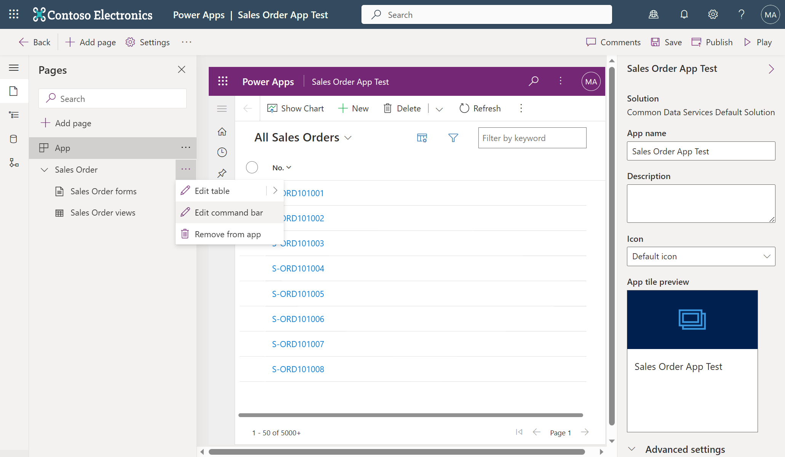
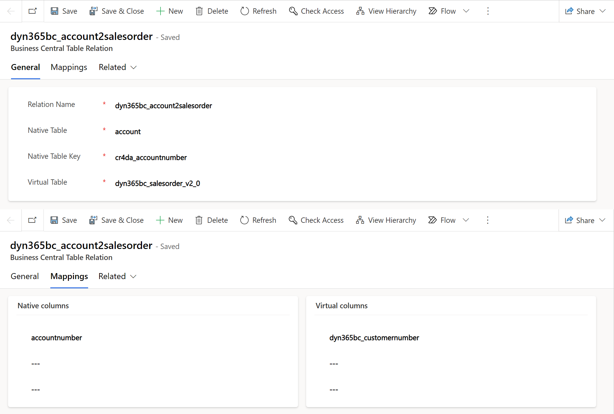
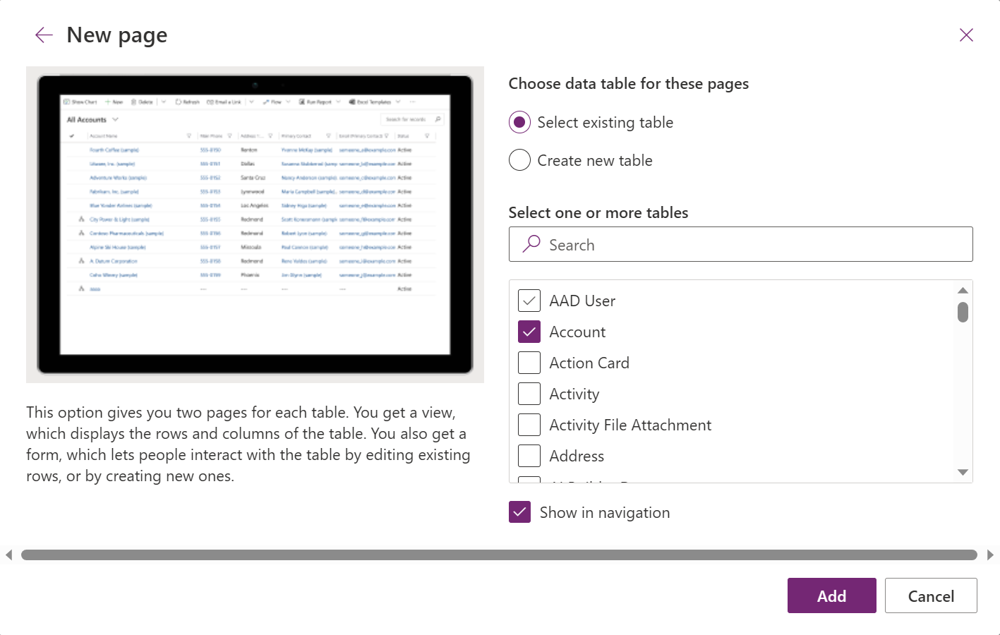
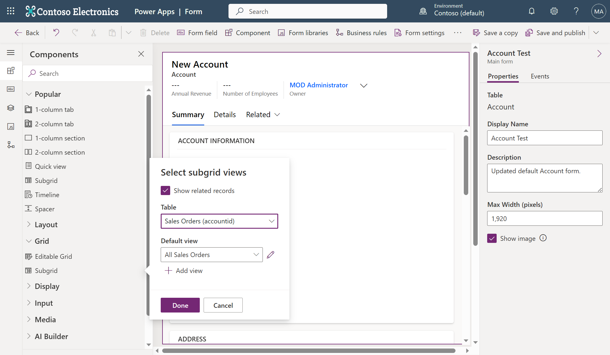
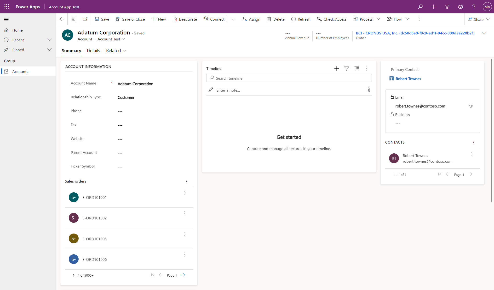

# Dataverse Integration Workshop

## Introduction
Integrating w/ Dataverse enables Business Central to interact w/ other apps in its ecosystem, see [a review of Business Central & Dataverse integration](https://github.com/microsoft/d365bcdv/blob/main/Review%20of%20Business%20Central%20and%20Dataverse%20integration.pdf).  There are four types of complementary app/system interactions: Data Sync that replicates data between Business Central & Dataverse, virtual tables on Dataverse via Business Central API for (**C**reate/**R**ead/**U**pdate/**D**elete) operations, data change (**CUD**) events, and business events.

This workshop focuses on those interactions enabled by our virtual table plugin that’s installed on Dataverse: virtual tables, data (CUD) events, and business events.

## Workshop environments & user accounts
For this workshop preparation, we’ve done the following:
- Provisioned a few pairs of Business Central & Dataverse environments
- Run the assisted setup on Business Central app to connect the paired environments
- Installed our virtual table plugin from AppSource on all Dataverse environments
- Generated a few virtual tables (*Customer/Item/Sales Order/Sales Order Line/Sales Invoice/Sales Invoice Line/Sales Shipment/Sales Shipment Line*) to make them visible on all Dataverse environments
- Created several user accounts w/ their respective username/password to perform exercises on the paired environments that are accessible to them, for example creating/configuring model-driven Power Apps, Power Automate flows, and Power Pages sites
- Created several contact accounts w/ their respective username/password to access Power Pages sites that have been created/configured by the above users

To avoid conflicts when performing exercises, each user account has a dedicated company on its Business Central environment.  For example, the user *alans@XXXXXXXXX.OnMicrosoft.com* has been assigned the *SUPER* permission set to access his dedicated *Cronus ALANS* company.  To access the pre-generated/visible virtual tables, each user account has been assigned the *System Customizer* security role on its Dataverse environment.  Each contact account represents a customer of the dedicated company and can access a Power Pages site mapped to that company.  For example, the contact *alan* represents *Adatum Corporation*, which is a customer of *Cronus ALANS* company, and can access [the Power Pages site mapped to *Cronus ALANS*](https://site-duyrl.powerappsportals.com/).

To reserve your user/contact accounts, enter your name in the "Reserved by" column, next to those accounts that are still available on our [reservation sheet](https://1drv.ms/x/s!XXXXXXXXXXXXXXXXXXXXXXXXXXXXXX?e=XXXXXX) and take note of the same password for all accounts.

Use your reserved user account, preferably in a dedicated browser profile/incognito browser mode, to access the [base app on your Business Central environment](https://businesscentral.dynamics.com/), [Power Apps maker portal on your Dataverse environment](https://make.powerapps.com/), [Power Automate maker portal on your Dataverse environment](https://make.powerautomate.com/), and the Power Pages site mapped to your dedicated company in our reservation sheet, so you can perform the following exercises:

- [Create model-driven Power Apps w/ virtual tables](#model)
  - [Customize model-driven Power Apps w/ custom views](#view)
  - [Customize model-driven Power Apps w/ custom forms](#form)
  - [Customize model-driven Power Apps w/ bound actions](#action)
- [Create model-driven Power Apps w/ synthetic relations between native & virtual tables](#synthetic)
- [Create Power Automate flows w/ data (CUD) event trigger for virtual table](#data)
- [Create Power Automate flows w/ business event trigger](#business)

## Create model-driven Power Apps w/ virtual tables
In this exercise, you’ll learn to create model-driven Power Apps that can view, create, and modify sales orders in the virtual *Sales Order* table.  You’ll also learn to customize them w/ custom views/forms, Editable Grid control, and bound actions.  To perform this exercise, follow these steps:
1.	On Power Apps maker portal, select the **Apps** section, **+ New app** dropdown menu, and **Model-driven** item.

   

2.	Enter your unique app name, such as *Sales Order App YourAlias*, and select the **Create** button.
3.	Select the **+ Add page** button, **Dataverse table** radio button, and **Next** button.

   

4.	Select the **Select existing table** radio button, search for the **Sales Order** check box to check, and select the **Add** button.

   
 
5.	Select the **Publish** button.

### Customize model-driven Power Apps w/ custom views
To customize model-driven Power Apps w/ custom views, follow these steps:
1.	On Power Apps maker portal, select the **Tables** section and search for the **Sales Order** table under the **All** tab to select.

   
 
2.	Select the **Views** section and **+ New view** button.
3.	Enter your unique view name, such as *All Sales Orders YourAlias*, and select the **Create** button to open Power Apps view designer.
4.	Select the **+ View column** button to add more columns to your view.

   

5.	Select the **Publish** button.
6.	On Power Apps maker portal, select the **Apps** section and your *Sales Order App YourAlias* app.
7.	Select the **All Sales Orders** dropdown menu and your *All Sales Orders YourAlias* view or the **Manage and share views** item to change your default view.

   

### Customize model-driven Power Apps w/ custom forms
To customize model-driven Power Apps w/ custom forms, follow these steps:
1.	On Power Apps maker portal, select the **Tables** section and search for the **Sales Order** table under the **All** tab to select.

   

2.	Select the **Forms** section, **+ New form** dropdown menu, and **+ Main Form** item to open Power Apps form designer.
3.	For the **Display Name** property, enter your unique form name, such as *Information YourAlias*, and select table columns to add as fields in your form.

   

4.	Select the **Component** button, **Grid** dropdown menu, **Subgrid** item, **Show related records** check box, and **Done** button.

   

5.	For the **Label** property, enter your descriptive subgrid name, such as *Lines*, and select the **Save and publish** button.
6.	Select the **Form settings** button and **Form order** section, reorder the list of forms w/ your *Information YourAlias* form on top, and select the **Save and publish** button.

   

7.	On Power Apps maker portal, select the **Apps** section and your *Sales Order App YourAlias* app.
8.	Select any sales order to be viewed in your *Information YourAlias* form w/ its lines subgrid.
9.	On Power Apps form designer, select your subgrid, **Components** dropdown menu, **+ Component** button, **Editable Grid** item, and **Done** button.

   

10. Select the **Save and publish** button.
11. On Power Apps maker portal, select the **Apps** section and your *Sales Order App YourAlias* app.
12. Select any sales order to be viewed in your *Information YourAlias* form w/ its editable lines subgrid.

    

### Customize model-driven Power Apps w/ bound actions
To customize model-driven Power Apps w/ bound actions, follow these steps:
1.	On Power Apps maker portal, select the **Apps** section and edit your *Sales Order App YourAlias* app.
2.	Select the *…* button next to **Sales Order** dropdown menu and **Edit command bar** item.

   

3.	Select the **Main form** radio button and **Edit** button.

   
 
4.	Select the **+ New** dropdown menu and **Command** item.

   

5.	Enter *Ship & Invoice* for the **Label** property, select **Use Icon** and **CreateInvoice** for the **Icon** property, select **Run Javascript** for the **Action** property, select *xxxxx_shipandinvoice* for the **Library** property, enter *InvokeAction* for the function name, and select the **Save and Publish** button.  We’ve created the library w/ that function by uploading the *shipandinvoice.js* file from this workshop folder.

   

6.	On Power Apps maker portal, select the **Apps** section and your *Sales Order App YourAlias* app.
7.	Select any sales order and the **Ship & Invoice** button to execute the bound action on that sales order.

   

## Create model-driven Power Apps w/ synthetic relations between native & virtual tables
For this exercise, we’ve used Data Sync to replicate Business Central customers as accounts in the native *Account* table.  We’ve also created a synthetic one-to-many relation between that table and the virtual *Sales Order* table, such that the relevant sales orders can appear as a subgrid in the form page of any selected account.

The synthetic relation has been created following [our table modeling article](https://learn.microsoft.com/dynamics365/business-central/dev-itpro/powerplatform/powerplat-entity-modeling#virtual-tabletonative-table-relationship).  To view this relation, follow these steps:
1.	On Power Apps maker portal, select the **Tables** section and search for the **Business Central Table Relation** table under the **All** tab to select.
2.	Select the **Edit** button, *dyn365bc_account2salesorder* row, and **Edit row using form** button

   

To perform this exercise, follow these steps:
1.	On Power Apps maker portal, select the **Apps** section, **+ New app** dropdown menu, and **Model-driven** item.

   

2.	Enter your unique app name, such as *Account App YourAlias*, and select the **Create** button.
3.	Select the **+ Add page** button, **Dataverse table** radio button, and **Next** button.

   

4.	Select the **Select existing table** radio button, search for the **Account** check box to check, and select the **Add** button.

   

5.	Select the **Account** dropdown menu, **Account forms** item, and **Edit form** button.
6.	For the **Display Name** property, enter your unique form name, such as *Account YourAlias*, then select the **Component** button, **Grid** dropdown menu, **Subgrid** item, **Show related records** check box, **Sales Orders (accountid)** item, and **Done** button.

   

7.	For the **Label** property, enter your descriptive subgrid name, such as *Sales orders*, and select the **Save and publish** button.
8.	On Power Apps maker portal, select the **Apps** section and your *Account App YourAlias* app.
9.	Select the **My Active Accounts** dropdown menu and **All Accounts** item.
10. Select any account representing Business Central customer to be viewed in your edited form w/ its sales orders subgrid.

    

## Create Power Automate flows w/ data (CUD) event trigger for virtual table
In this exercise, you’ll learn to create Power Automate flows w/ data (CUD) event trigger for virtual table that’s offered by the standard Dataverse connector.  To perform this exercise, follow these steps:
1.	On Power Apps maker portal, select the **Flows** section, **+ New flow** dropdown menu, and **Automated code flow** item.

   

2.	Enter *Data (CUD) event* as your flow name, search for the **When a row is added, modified or deleted** trigger to add, and select the **Create** button.

   

3.	Select **Added or Modified or Deleted** for the **Change type** property, **Customers** for the **Table name** property, **Organization** for the **Scope** property, and **Show advanced options** to see more properties.
4.	While all event subscriptions from Dataverse are done for all accessible companies in Business Central, data (CUD) event notifications can be filtered for just one company, so enter *dyn365bc_companylookup_code eq 'YourCompanyName'* for the **Filter rows** property, and select the **+ New step** button.

   

5.	Search for the **Get a row by ID** operation to add, select **Customers** for the **Table name** property, and enter the **Row ID** field to see some parameters from the previous step.
6.	Select the **See more** button to see all parameters, **Id** parameter for **Row ID** property, and **Save** button.

   

7.	On Business Central app, create/update/delete a customer.
8.	On Power Apps maker portal, select the **Flows** section, your *Data (CUD) event* flow, and the latest run in its **28-day run history**.

   

9.	See the event payload and query result from the latest run of your *Data (CUD) event* flow that match the properties of created/updated/deleted customer.

   

   

## Create Power Automate flows w/ business event trigger
In this exercise, you’ll learn to create Power Automate flows w/ business event trigger that’s offered by the standard Dataverse connector.  To perform this exercise, follow these steps:
1.	On Power Apps maker portal, select the **Flows** section, **+ New flow** dropdown menu, and **Automated code flow** item.

   

2.	Enter *Customer blocked event* as your flow name, search for the **When an action is performed** trigger to add, and select the **Create** button.

   

3.	Select **Dynamics 365 Business Central** for the **Catalog** property, **My Accounts Receivable Events** for the **Category** property, **(none)** for the **Table name** property, **Customer blocked** for the **Action name** property, and the **+ New step** button.

   

4.	Search for the **Get a row by ID** operation to add, select **Customers** for the **Table name** property, and enter the **Row ID** field to see all parameters from the previous step.
5.	Select the **ActionInputs CustomerId** parameter for **Row ID** property and **Save** button.

   

6.	On Business Central app, block a customer.
7.	On Power Apps maker portal, select the **Flows** section, your *Customer blocked event* flow, and the latest run in its **28-day run history**.

   

8.	See the event payload and query result from the latest run of your *Customer blocked event* flow that match the properties of blocked customer.

   

   

