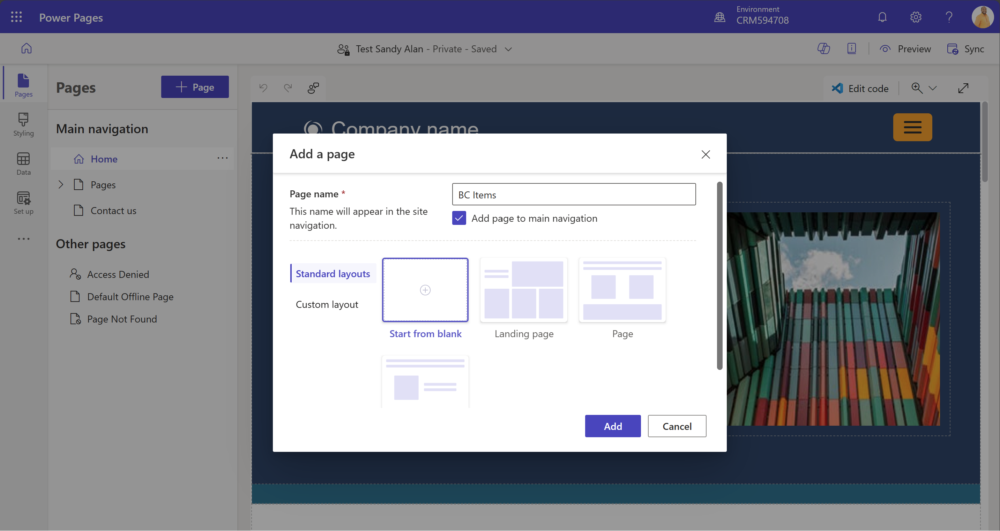
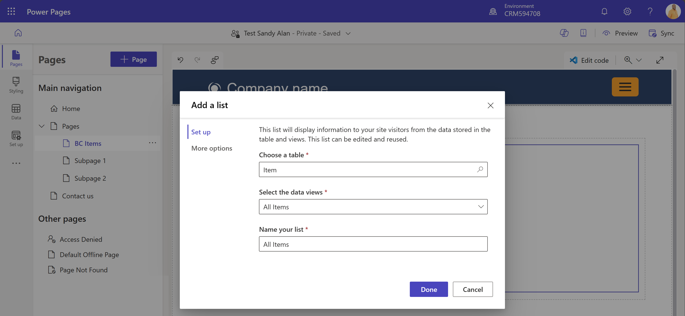
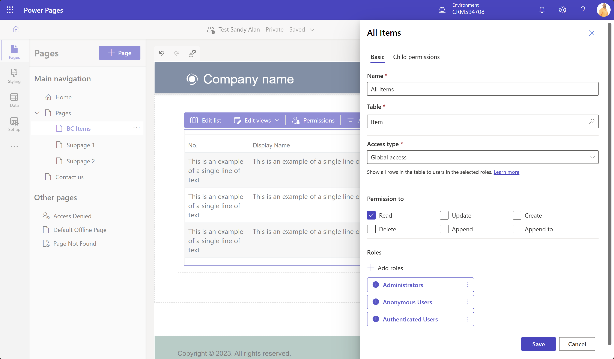
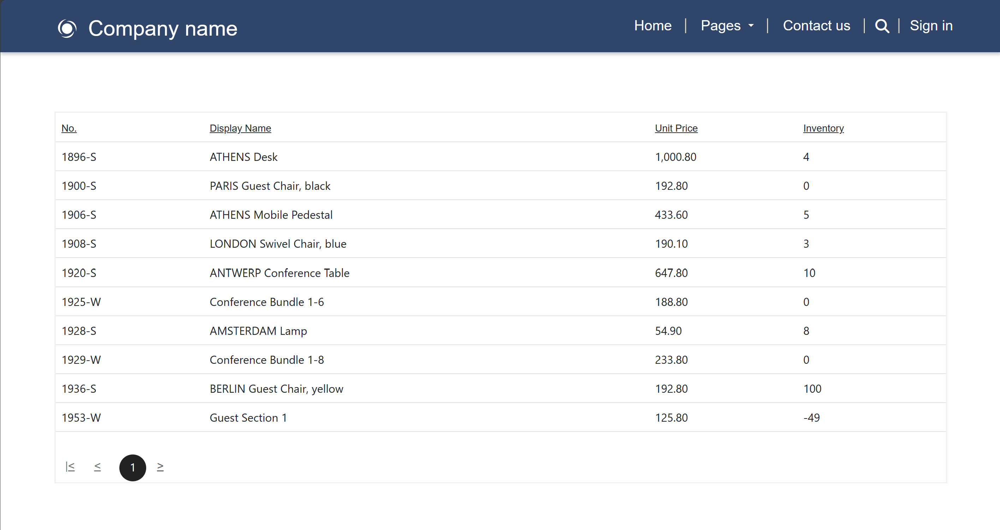

# Dataverse Integration Workshop

## Introduction
Integrating w/ Dataverse enables Business Central to interact w/ other apps in its ecosystem, see [a review of Business Central & Dataverse integration](https://github.com/microsoft/d365bcdv/blob/main/Review%20of%20Business%20Central%20and%20Dataverse%20integration.pdf).  There are four types of complementary app/system interactions: Data Sync that replicates data between Business Central & Dataverse, virtual tables on Dataverse via Business Central API for (**C**reate/**R**ead/**U**pdate/**D**elete) operations, data change (**CUD**) events, and business events.

This workshop focuses on those interactions enabled by our virtual table plugin that’s installed on Dataverse: virtual tables, data (CUD) events, and business events.

## Workshop environments & user accounts
For this workshop preparation, we’ve done the following:
- Provisioned a few pairs of Business Central & Dataverse environments
- Run the assisted setup on Business Central app to connect the paired environments
- Installed our virtual table plugin from AppSource on all Dataverse environments
- Generated a few virtual tables (*Customer/Item/Sales Order/Sales Order Line*) to make them visible on all Dataverse environments
- Created several user accounts w/ their respective username/password to perform exercises on the paired environments that are accessible to them, for example creating/configuring model-driven Power Apps, Power Automate flows, and Power Pages sites
- Created several contact accounts w/ their respective username/password to access Power Pages sites that have been created/configured by the above users

To avoid conflicts when performing exercises, each user account has a dedicated company on its Business Central environment.  For example, the user *alans@XXXXXXXXX.OnMicrosoft.com* has been assigned the *SUPER* permission set to access his dedicated *Cronus ALANS* company.  To access the pre-generated/visible virtual tables, each user account has been assigned the *System Customizer* security role on its Dataverse environment.  Each contact account represents a customer of the dedicated company and can access a Power Pages site mapped to that company.  For example, the contact *alan* represents *Adatum Corporation*, which is a customer of *Cronus ALANS* company, and can access the Power Pages site mapped to *Cronus ALANS*.

To reserve your user/contact accounts, enter your name/alias in the "Reserved by" column, next to those accounts that are still available on our [reservation sheet](https://1drv.ms/x/s!Ag4kKioQJdg6gdA0-KhrKmJfd5yNCg?e=r9M7hf) and take note of the same password for all accounts.

Use your reserved user account, preferably in a dedicated browser profile/incognito browser mode, to access the [base app on your Business Central environment](https://businesscentral.dynamics.com/), [Power Apps maker portal on your Dataverse environment](https://make.powerapps.com/), [Power Automate maker portal on your Dataverse environment](https://make.powerautomate.com/), and the Power Pages site mapped to your dedicated company in our reservation sheet, so you can perform the following exercises:

- [Create model-driven Power Apps w/ virtual tables](#model)
  - [Customize model-driven Power Apps w/ custom views](#view)
  - [Customize model-driven Power Apps w/ custom forms](#form)
  - [Customize model-driven Power Apps w/ bound actions](#action)
- [Create model-driven Power Apps w/ synthetic relations between native & virtual tables](#synthetic)
- [Create Power Automate flows w/ data (CUD) event trigger for virtual table](#data)
- [Create Power Automate flows w/ business event trigger](#business)
- [Enable anonymous access to Business Central data for external users via Power Pages](#anonymous)
- [Enable authenticated access to Business Central data for external users via Power Pages](#authenticated)
- [Add Edit action to Power Pages lists](#list)
- [Add Edit action to Power Pages subgrids linked to lists](#subgrid)

## Create model-driven Power Apps w/ virtual tables
In this exercise, you’ll learn to create model-driven Power Apps that can view, create, and modify sales orders in the virtual *Sales Order* table.  You’ll also learn to customize them w/ custom views/forms and bound actions.  To perform this exercise, follow these steps:
1. On Power Apps maker portal, select the **Apps** section, **+ New app** dropdown menu, and **Start with a page design** item.
1. Select the **Filter** dropdown menu, **Model-driven app** item, and **Blank page with navigation** design.
1. Enter your unique app name, such as *YourAlias Sales Order App*, and select the **Create** button.
1. Select the **+ Add page** button, **Dataverse table** radio button, and **Next** button.

   

1. Select the **Select existing table** radio button, search for the **Sales Order** check box to check, and select the **Add** button.

   
 
1. Select the **Publish** button.

### Customize model-driven Power Apps w/ custom views
To customize model-driven Power Apps w/ custom views, follow these steps:
1. On Power Apps maker portal, select the **Tables** section and search for the **Sales Order** table under the **All** tab to select.

   
 
1. Select the **Views** section and **+ New view** button.
1. Enter your unique view name, such as *YourAlias All Sales Orders View*, and select the **Create** button to open Power Apps view designer.
1. Select the **+ View column** button to add more columns to your view.

   

1. Select the **Save and publish** button.
1. On Power Apps maker portal, select the **Apps** section and run *YourAlias Sales Order App*.
1. Select the **All Sales Orders** dropdown menu and *YourAlias All Sales Orders View* or the **Manage and share views** item to change your default view.

   

### Customize model-driven Power Apps w/ custom forms
To customize model-driven Power Apps w/ custom forms, follow these steps:
1. On Power Apps maker portal, select the **Tables** section and search for the **Sales Order** table under the **All** tab to select.

   

1. Select the **Forms** section, **+ New form** dropdown menu, and **+ Main Form** item to open Power Apps form designer.
1. For the **Display Name** property, enter your unique form name, such as *YourAlias Sales Order Main Form*, and select table columns to add as fields in your form.

   

1. Select the *…* button next to **Form properties** button, **Form settings** button, **Security roles** section, **Everyone** radio button, **Fallback forms** section, **Enable "YourAlias Sales Order Main Form" form as a Fallback form** check box, **Form order** section, and move *YourAlias Sales Order Main Form* closer to the top.
1. Select the **Save and publish** button.
1. On Power Apps maker portal, select the **Apps** section and edit *YourAlias Sales Order App*.
1. Select the **Sales Orders form** section and remove all other Main Forms in this app, except *YourAlias Sales Order Main Form*.
1. Select the **Save and publish** button.
1. On Power Apps maker portal, select the **Apps** section and run *YourAlias Sales Order App*.
1. Select any sales order to be viewed in *YourAlias Sales Order Main Form*.

### Customize model-driven Power Apps w/ bound actions
To customize model-driven Power Apps w/ bound actions, follow these steps:
1. On Power Apps maker portal, select the **Apps** section and edit *YourAlias Sales Order App*.
1. Select the *…* button next to **Sales Orders view** section and **Edit command bar** item.
1. Select the **Main form** radio button and **Edit** button.

   
 
1. Select the **+ New** dropdown menu, **Command** item, **JavaScript** radio button, and **Continue** button.

   

1. Enter *Ship & Invoice* for the **Label** property, select **Use Icon** and **CreateInvoice** for the **Icon** property, select **Run Javascript** for the **Action** property, select *xxxxx_shipandinvoice* for the **Library** property, enter *InvokeAction* for the function name, and select the **Save and Publish** button.  We’ve created the library w/ that function by uploading the *shipandinvoice.js* file from this workshop folder.

   

1. On Power Apps maker portal, select the **Apps** section and run *YourAlias Sales Order App*.
1. Select any sales order and the **Ship & Invoice** button to execute the bound action on that sales order.

   

## Create model-driven Power Apps w/ synthetic relations between native & virtual tables
For this exercise, we’ve created a synthetic one-to-many relation between the native *Contact* table and the virtual *Sales Order* table, such that the relevant sales orders can appear as a subgrid in the form page of any selected contact representing a customer of Business Central company.

The synthetic relation has been created following [our table modeling article](https://learn.microsoft.com/dynamics365/business-central/dev-itpro/powerplatform/powerplat-entity-modeling#virtual-tabletonative-table-relationship).  To view this relation, follow these steps:
1. On Power Apps maker portal, select the **Tables** section and search for the **Business Central Table Relation** table under the **All** tab to select.
1. Select the **Edit** button, *dyn365bc_contact2salesorder* row, and **Edit row using form** button.

To perform this exercise, follow these steps:
1. On Power Apps maker portal, select the **Apps** section, **+ New app** dropdown menu, and **Start with a page design** item.
1. Select the **Filter** dropdown menu, **Model-driven app** item, and **Blank page with navigation** design.
1. Enter your unique app name, such as *YourAlias Contact App*, and select the **Create** button.
1. Select the **+ Add page** button, **Dataverse table** radio button, and **Next** button.

   

1. Select the **Select existing table** radio button, search for the **Contact** check box to check, and select the **Add** button.
1. Select the **Account** dropdown menu, **Account forms** item, and **Edit form** button.
1. Select the **Contacts form** section, **+ New form** button, **Main Form** radio button, and **Create** button to open Power Apps form designer.
1. For the **Display Name** property, enter your unique form name, such as *YourAlias Contact Main Form*, and select table columns to add as fields in your form.
1. Select the **Component** button, **Grid** dropdown menu, **Subgrid** item, **Show related records** check box, **Sales Orders (contactid)** item, and **Done** button.
1. For the **Label** property, enter your descriptive subgrid name, such as *Sales Orders*, and select the **Save and publish** button.
1. Select the *…* button next to **Form properties** button, **Form settings** button, **Security roles** section, **Everyone** radio button, **Fallback forms** section, **Enable "YourAlias Contact Main Form" form as a Fallback form** check box, **Form order** section, and move *YourAlias Contact Main Form* closer to the top.
1. Select the **Save and publish** button.
1. On Power Apps maker portal, select the **Apps** section and edit *YourAlias Contact App*.
1. Select the **Contacts form** section and remove all other Main Forms in this app, except *YourAlias Contact Main Form*.
1. Select the **Save and publish** button.
1. On Power Apps maker portal, select the **Apps** section and run *YourAlias Contact App*.
1. Select any contact to be viewed in *YourAlias Contact Main Form*.

## Create Power Automate flows w/ data (CUD) event trigger for virtual table
In this exercise, you’ll learn to create Power Automate flows w/ a data (CUD) event trigger for virtual table that’s offered by the standard Dataverse connector.  To perform this exercise, follow these steps:
1. On Power Apps/Automate maker portal, select the **Flows** section, **+ New flow** dropdown menu, and **Automated cloud flow** item.

   

1. Enter *YourAlias Data (CUD) Event Flow* as your flow name, search for the **When a row is added, modified or deleted** trigger to add, and select the **Create** button.

   

1. Select **Added or Modified or Deleted** for the **Change type** property, **Customers** for the **Table name** property, **Organization** for the **Scope** property, and **Show advanced options** to see more properties.
1. While all event subscriptions from Dataverse are done for all accessible companies in Business Central, data (CUD) event notifications can be filtered for just one company, so enter *dyn365bc_companylookup_code eq 'YourCompanyName'* for the **Filter rows** property, and select the **+ New step** button.

   

1. Search for the **Get a row by ID** operation to add, select **Customers** for the **Table name** property, and enter the **Row ID** field to see some parameters from the previous step.
1. Select the **See more** button to see all parameters, **Id** parameter for **Row ID** property, and **Save** button.

   

1. On Business Central app, create/update/delete a customer.
1. On Power Apps/Automate maker portal, select the **Flows** section, *YourAlias Data (CUD) Event Flow*, and the latest run in its **28-day run history**.

   

1. See the event payload and query result from the latest run of *YourAlias Data (CUD) Event Flow* that match the properties of created/updated/deleted customer.

   

   

## Create Power Automate flows w/ business event trigger
In this exercise, you’ll learn to create Power Automate flows w/ a business event trigger that’s offered by the standard Dataverse connector.  To perform this exercise, follow these steps:
1. On Power Apps/Automate maker portal, select the **Flows** section, **+ New flow** dropdown menu, and **Automated cloud flow** item.

   

1. Enter *YourAlias Customer Blocked Event Flow* as your flow name, search for the **When an action is performed** trigger to add, and select the **Create** button.

   

1. Select **Dynamics 365 Business Central** for the **Catalog** property, **My Accounts Receivable Events** for the **Category** property, **(none)** for the **Table name** property, **Customer blocked** for the **Action name** property, and the **+ New step** button.

   

1. Search for the **Get a row by ID** operation to add, select **Customers** for the **Table name** property, and enter the **Row ID** field to see all parameters from the previous step.
1. Select the **ActionInputs CustomerId** parameter for **Row ID** property and **Save** button.

   

1. On Business Central app, block a customer.
1. On Power Apps/Automate maker portal, select the **Flows** section, *YourAlias Customer Blocked Event Flow*, and the latest run in its **28-day run history**.

   

1. See the event payload and query result from the latest run of *YourAlias Customer Blocked Event Flow* that match the properties of blocked customer.

   

   

## Enable anonymous access to Business Central data for external users via Power Pages
For this exercise, we’ve created Power Pages sites that are mapped to Business Central companies.  These companies are dedicated to and only accessible by their respective user accounts that you can reserve.  On Power Pages maker portal, you can sign in w/ your reserved user account and configure Power Pages site that's mapped to your dedicated company to add a page that enables anonymous access to Business Central data for external users.
1. Go to Power Pages maker portal URL that comes w/ your reserved user account to configure Power Pages site that's mapped to your dedicated company.
1. Select the **+ Page** button, enter *BC Items* as your page name, and select the **Add** button.
   
   
   
1. Drag & drop *BC Items* under the **Pages** section.
1. Select the **List** item and **+ New list** button.

   
   
1. Search and select the **Item** table.
1. Select the **All Items** view and **Done** button.

   
   
1. Select the **Permission** button, **All Items** permission, and **Global access** type.
1. Add the **Read** permission and **Anonymous Users** role.

   
   
1. Select the **Save** and **Sync** buttons.
1. Select the **Preview** button to check that external users can see the Item table from Business Central w/o signing in.

   

## Enable authenticated access to Business Central data for external users via Power Pages
On Power Pages maker portal, you can sign in w/ your reserved user account and configure Power Pages site that's mapped to your dedicated company to add a page that enables authenticated access to Business Central data for external users.
1. Go to Power Pages maker portal URL that comes w/ your reserved user account to configure Power Pages site that's mapped to your dedicated company.
1. Select the **+ Page** button, enter *BC Sales Orders* as your page name, and select the **Add** button.
1. Drag & drop *BC Sales Orders* under the **Pages** section.
1. Select the **List** item and **+ New list** button.
1. Search and select the **Sales Order** table.
1. Select the **All Sales Orders** view and **Done** button.
1. Select the **Permission** button, **All Sales Orders** permission, **Contact access** type, and *dyn365bc_contact2salesorder* synthetic relationship.
1. Add all permissions except the **Delete** permission and **Authenticated Users** role.
1. Select the **Save** and **Sync** buttons.
1. Select the **Preview** button to check that external users can see the Sales Order table from Business Central after signing in.

## Add Edit action to Power Pages lists
On Power Pages maker portal, you can add Edit action to existing lists.
1. Go to Power Pages maker portal URL that comes w/ your reserved user account to configure Power Pages site that's mapped to your dedicated company.
1. Select the **...** button below **Set up** button and **Power Pages Management** option that opens Power Pages Management portal in another tab.
1. On Power Pages Management portal, select the **Basic Forms** section and **+ New** button.
1. Enter *YourAlias Sales Order Basic Form* for the **Name** property and *id* for the **Record ID Parameter Name** property.
1. Select *Sales Order (dyn365bc_salesorder_v2_0)* for the **Table Name** property, *Information* for the **Form Name** property, *Edit* for the **Mode** property, *Query String* for the **Record Source Type** property, and your mapped Power Pages site for the **Website* property.
1. Select the **Save** button.
1. On Power Pages Management portal, select the **List** section, **All Sales Orders** list, and **Options** tab.
1. Select the **+ Edit** button in **Grid configuration** section.
1. Select *Basic Form* for the **Target Type** property and *YourAlias Sales Order Basic Form* for the **Basic Form** property.
1. Select the **Save** button.
1. Since the default sales order form has been designed to include a subgrid of sales order lines, authenticated users also need to be assigned all except **Delete** *permissions to access the Sales Order Line table. 
1. Select the **Save** and **Sync** buttons.
1. Select the **Preview** button to check that external users can edit the Sales Order lists from Business Central after signing in.

## Add Edit action to Power Pages subgrids linked to lists
On Power Pages maker portal, you can add Edit action to existing subgrids.
1. Go to Power Pages maker portal URL that comes w/ your reserved user account to configure Power Pages site that's mapped to your dedicated company.
1. Select the **...** button below **Set up** button and **Power Pages Management** option that opens Power Pages Management portal in another tab.
1. On Power Pages Management portal, select the **Basic Forms** section and **+ New** button.
1. Enter *YourAlias Sales Order Line Basic Form* for the **Name** property and *id* for the **Record ID Parameter Name** property.
1. Select *Sales Order ine (dyn365bc_salesorderline_v2_0)* for the **Table Name** property, *Information* for the **Form Name** property, *Edit* for the **Mode** property, *Query String* for the **Record Source Type** property, and your mapped Power Pages site for the **Website* property.
1. Select the **Save** button.
1. On Power Pages Management portal, select the **Basic Forms** section, *YourAlias Sales Order Basic Form*, **Basic Form Metadata** tab, and **+ New Basic Form Metadata** button.
1. Select *Subgrid* for the **Type** property and *Subgrid_new_1* for the **Subgrid Name** property.
1. Select the **+ Edit** button in **Grid configuration** section.
1. Select *Basic Form* for the **Target Type** property and *YourAlias Sales Order Line Basic Form* for the **Basic Form** property.
1. Select the **Save** and **Sync** buttons.
1. Select the **Preview** button to check that external users can edit the Sales Order Line subgrids linked to Sales Order lists from Business Central after signing in.

